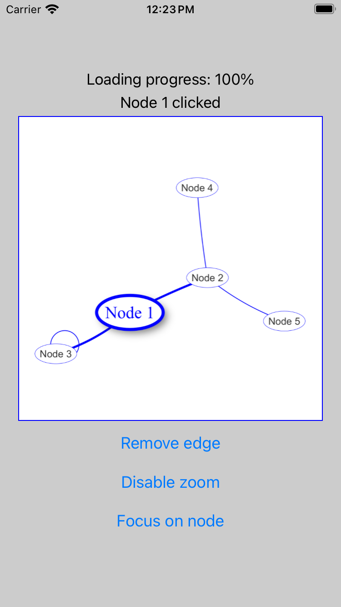

# react-native-vis-network

[react-native-vis-network](https://github.com/High5Apps/react-native-vis-network#readme) lets you use [vis-network](https://github.com/visjs/vis-network#readme) in your [React Native](https://reactnative.dev/) projects.



## Installation

```sh
# react-native-vis-network needs to use react-native-webview to work correctly,
# so install it if you haven't previously installed it in your project
npm install react-native-webview

npm install react-native-vis-network
```

## Usage

```js
import React from 'react';
import VisNetwork from 'react-native-vis-network';

export default function MyComponent() {
  
  // Create an array with nodes
  const nodes = [
    { id: 1, label: 'Node 1' },
    { id: 2, label: 'Node 2' },
    { id: 3, label: 'Node 3' },
    { id: 4, label: 'Node 4' },
    { id: 5, label: 'Node 5' },
  ];

  // Create an array with edges
  const edges = [
    { from: 1, to: 3 },
    { from: 1, to: 2 },
    { from: 2, to: 4 },
    { from: 2, to: 5 },
    { from: 3, to: 3 },
  ];

  // Create a VisNetwork
  const data = { edges, nodes };
  return <VisNetwork data={data} />;
}
```

## Contributing

See the [contributing guide](CONTRIBUTING.md) to learn how to contribute to the repository and the development workflow.

## License

MIT

---

Made with [create-react-native-library](https://github.com/callstack/react-native-builder-bob)
