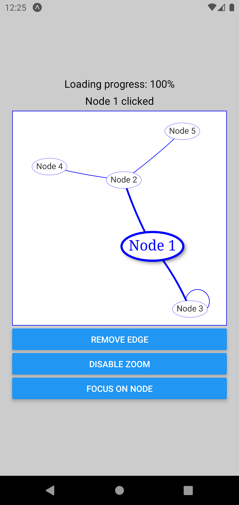

# react-native-vis-network

[react-native-vis-network](https://github.com/High5Apps/react-native-vis-network#readme) lets you use [vis-network](https://github.com/visjs/vis-network#readme) in your [React Native](https://reactnative.dev/) projects.

## iOS example


## Android example


## Installation

```sh
# react-native-vis-network needs to use react-native-webview to work correctly,
# so install it if you haven't previously installed it in your project
npm install react-native-webview

npm install react-native-vis-network
```

## Usage

```js
import React, { useState } from 'react';
import VisNetwork, { Data } from 'react-native-vis-network';

export default function MyComponent() {
  const [data, setData] = useState<Data>({
    edges: [
      { from: 1, to: 3 },
      { from: 1, to: 2 },
      { from: 2, to: 4 },
      { from: 2, to: 5 },
      { from: 3, to: 3 },
    ],
    nodes: [
      { id: 1, label: 'Node 1' },
      { id: 2, label: 'Node 2' },
      { id: 3, label: 'Node 3' },
      { id: 4, label: 'Node 4' },
      { id: 5, label: 'Node 5' },
    ],
  });
  return <VisNetwork data={data} />;
}
```

### Event Listeners
You can add event listeners for any [vis-network Event](https://visjs.github.io/vis-network/docs/network/#Events).

Note that the earliest time you can successfully add an event listener is during the `onLoad` callback. If you try to add an event listener before then your callback won't be called.

```js
  const [loading, setLoading] = useState<boolean>(false);
  const visNetworkRef = useRef<VisNetworkRef>(null);

  useEffect(() => {
    if (!loading || !visNetworkRef.current) {
      return;
    }

    const subscription = visNetworkRef.current.addEventListener(
      'click',
      (event: any) => console.log(JSON.stringify(event, null, 2))
    );

    return subscription.remove;
  }, [loading]);

  // ...

  return (
    <VisNetwork
      data={data}
      onLoad={() => setLoading(true)}
      ref={visNetworkRef}
    />
  );
```

### Methods
You can use any of the [vis-network methods](https://visjs.github.io/vis-network/docs/network/#methods) that are not discussed in the caveats below.

#### Caveats
1. It's not possible to use the following methods due to their non-serializable parameters:
    - [`cluster`](https://visjs.github.io/vis-network/docs/network/#methodClustering)
    - [`clusterByConnection`](https://visjs.github.io/vis-network/docs/network/#methodClustering)
    - [`clusterByHubsize`](https://visjs.github.io/vis-network/docs/network/#methodClustering)
    - [`clusterOutliers`](https://visjs.github.io/vis-network/docs/network/#methodClustering)
    - [`openCluster`](https://visjs.github.io/vis-network/docs/network/#methodClustering)
    - [`updateClusteredNode`](https://visjs.github.io/vis-network/docs/network/#methodClustering)
    - [`updateEdge`](https://visjs.github.io/vis-network/docs/network/#methodClustering)
2. It's not possible to use the following methods due to various issues discussed in [87da46d](https://github.com/High5Apps/react-native-vis-network/commit/87da46d):
    - [`disableEditMode`](https://visjs.github.io/vis-network/docs/network/#methodManipulation)
    - [`editNode`](https://visjs.github.io/vis-network/docs/network/#methodManipulation)
    - [`enableEditMode`](https://visjs.github.io/vis-network/docs/network/#methodManipulation)
    - [`setSelection`](https://visjs.github.io/vis-network/docs/network/#methodSelection)
    - [`storePositions`](https://visjs.github.io/vis-network/docs/network/#methodInformation)
3. Intentionally, the methods [`on`](https://visjs.github.io/vis-network/docs/network/#methodGlobal), [`off`](https://visjs.github.io/vis-network/docs/network/#methodGlobal), and [`once`](https://visjs.github.io/vis-network/docs/network/#methodGlobal) have  not been implemented. Instead, use `addEventListener` as described in [Event Listeners](#event-listeners).
4. While using methods like `addEdgeMode`, `addNodeMode`, `setData`, and `setOptions` will successfully update and re-render the network, they will not update the `data` or `options` props passed into `VisNetwork`. Using any of these methods will cause the props to become out-of-sync with what is actually displayed.

#### Example
```js
  // ...

  const visNetworkRef = useRef<VisNetworkRef>(null);

  // ...

  return (
    <>
      <VisNetwork data={data} ref={visNetworkRef} />
      <Button
        title="Focus on node 1"
        onPress={() => {
          const nodeId = 1;
          visNetworkRef.current?.focus(nodeId, { animation: true, scale: 5 });
        }}
      />
    </>
  );
```

## Contributing

See the [contributing guide](CONTRIBUTING.md) to learn how to contribute to the repository and the development workflow.

## License

MIT

---

Made with [create-react-native-library](https://github.com/callstack/react-native-builder-bob)
